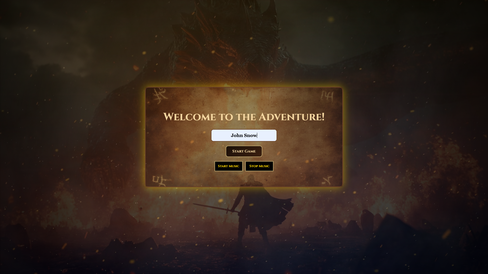
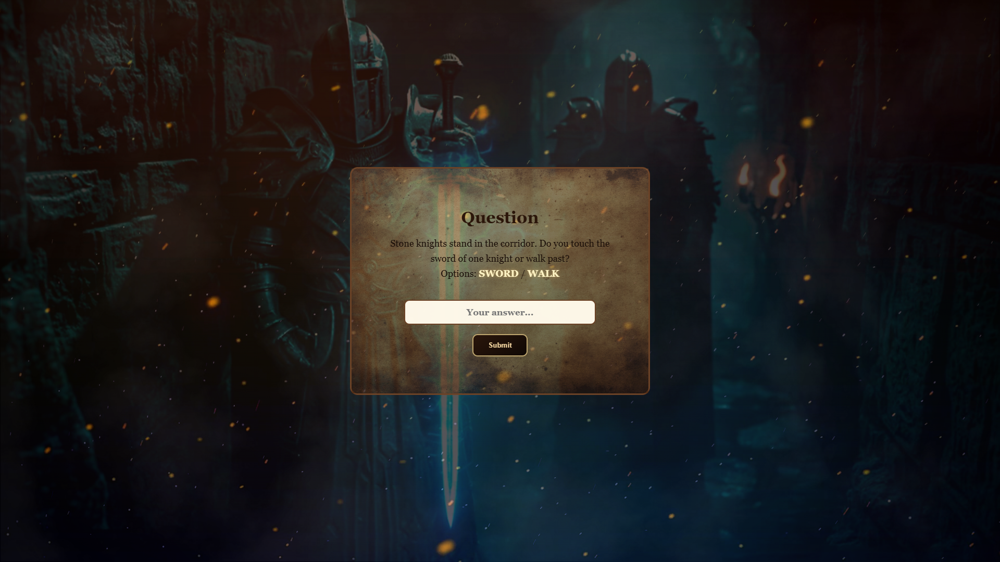
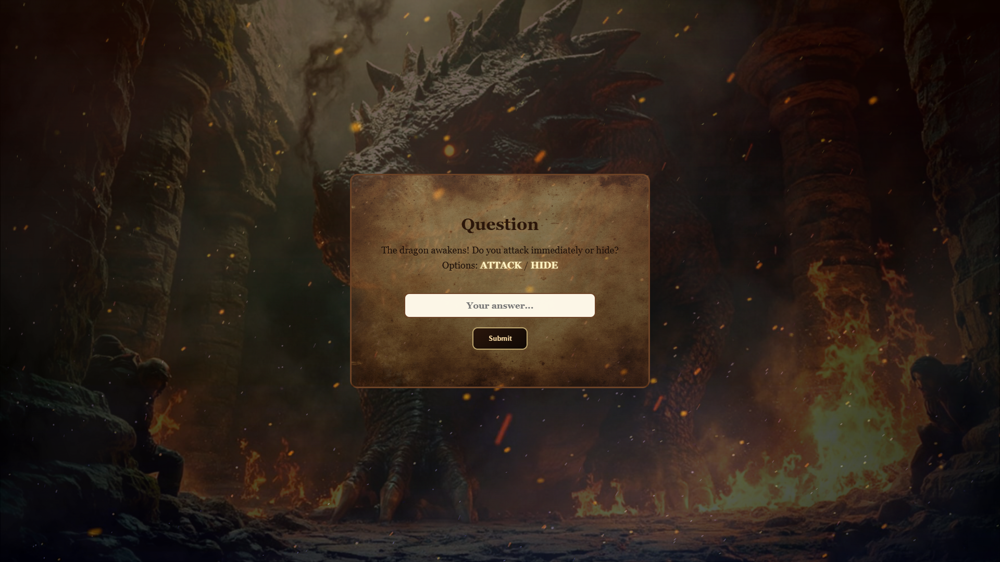
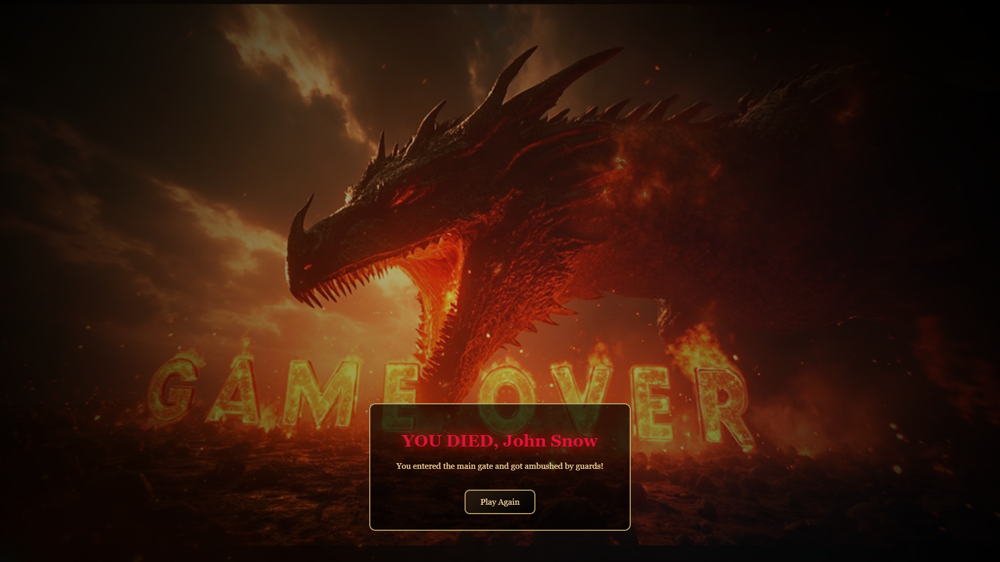
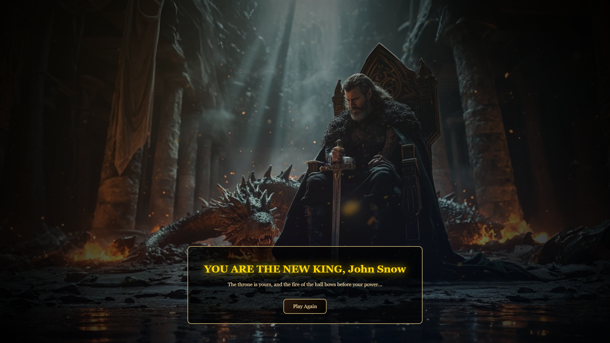

---

## 🎬 Cinematic Gameplay


<p align="center">
  <em>Cinematic browser experience with dynamic visuals, fire, smoke and immersive storytelling</em>
</p>

---

# 🏰 TEXT ADVENTURE

### *A Cinematic Browser Experience*

---

## 🎮 Live Demo

👉 **Play now:** https://text-adventure-r4rq.onrender.com/

---

## 🧾 ABOUT THE GAME

Enter a forgotten castle where every step could be your last.
Shadows whisper, fire flickers, and your choices shape the story.

**Text Adventure** is a cinematic, story-driven experience built entirely in the browser.
No engines. No frameworks. Just pure logic, atmosphere, and immersion.

Will you survive… or become part of the legend?

---

## ✨ KEY FEATURES

### ⚔️ Meaningful Choices

Every decision matters.
Choose wisely — there are no second chances.

* Branching narrative paths
* Multiple endings (Victory 👑 / Death ☠️)
* Instant feedback on player actions

---

### 🎬 Cinematic Visuals

Not just text — a fully styled visual experience.

* 🔥 Layered video backgrounds (fire + smoke)
* 🌫️ Dynamic overlays & color grading
* 🌑 Soft vignette for depth
* 🌬️ “Breathing” animated backgrounds
* 💥 Screen shake feedback on actions

---

### 🧠 Immersive Text System

The story doesn’t just appear — it unfolds.

* Word-by-word animated text
* Clean readability over dynamic backgrounds
* Atmospheric narrative presentation

---

### 🔊 Atmosphere First

* Background music enhances immersion
* Visual + motion + audio work together

---

## 🖼️ VISUAL PREVIEW

<p align="center">
  
  
  
  
  
</p>

---

## ⚙️ TECH STACK

* **Java (Servlets + JSP)**
* **HTML5 / CSS3 (animations, filters, layering)**
* **Vanilla JavaScript**
* **Apache Tomcat**
* **Maven**

---

## 🚀 RUN LOCALLY

### Requirements

* Java 17 (OpenJDK)
* Apache Tomcat 9+

---

### 1. Build project

```bash
mvn clean install
```

---

### 2. Deploy to Tomcat

* Open your Tomcat configuration (IDE or standalone)
* Deploy artifact: `text-adventure:war exploded`
* Set Application Context: `/`

---

### 3. Run server and open in browser

```
http://localhost:8080/welcome.jsp
```

---

## 🧪 SYSTEM FEATURES

* Game state handled via `GameService`
* Request flow via Servlets (`StartServlet`, `QuestionServlet`)
* Logging system (`logs.txt`) tracking player actions

---

## 🎯 DESIGN PHILOSOPHY

> “Make it feel alive, even without a game engine.”

This project focuses on:

* Atmosphere over complexity
* Cinematic feel using simple web technologies
* Clean interaction between backend logic and frontend visuals

---

## 👤 DEVELOPER

**Yuri (Rarxan)**
- GitHub: https://github.com/Rarxan

Java backend developer focused on interactive web applications.

- Backend logic (Java, Servlets, JSP)  
- Game design & decision flow  
- UI/UX & visual effects  
- Animation systems  

---

## 🧠 FINAL NOTE

This isn’t just a web application.
It’s an experiment in turning classic server-side technology into an immersive interactive experience.

---

🔥 *Press Start Game. Make a choice. Accept the consequences.*
